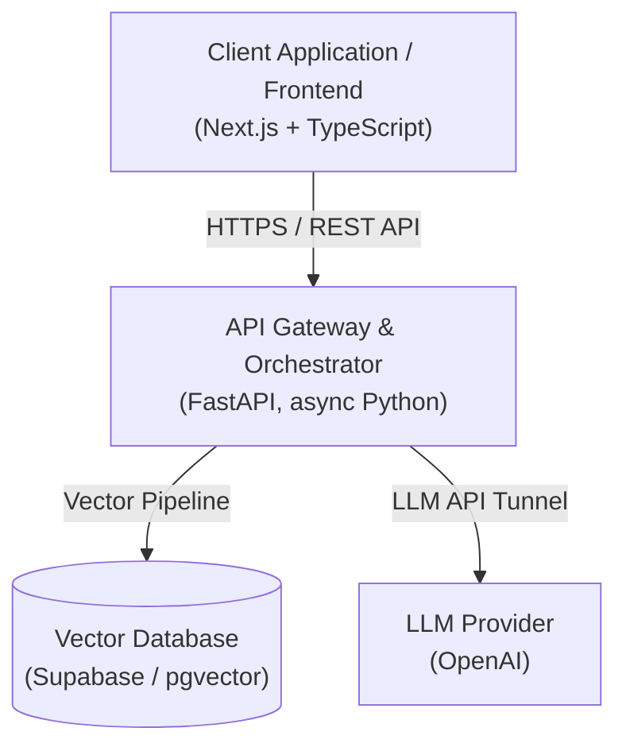

# Enterprise RAG (Retrieval-Augmented Generation) Architecture

A production-ready, secure, and fully decoupled RAG infrastructure for document intelligence — built to ingest corporate documents (PDF, DOCX, TXT, MD) and answer questions grounded strictly in that content, with zero hallucination tolerance.

> 🔒 **Proprietary Software Notice:** The source code of this engine lives in a private repository to protect proprietary business logic and integration standards. This document serves as the official architectural blueprint and technical overview for clients, partners, and technical evaluators.

---

## 🚀 Executive Demo

Watch a short walkthrough of the engine ingesting a document, indexing it into a vector store, and answering questions with cited, hallucination-free responses.

👉 **[WATCH THE DEMO](#)** *(Add your Loom/video link here)*

---

## 🏛️ System Architecture

The system follows a decoupled, service-oriented design that separates the AI orchestration layer from storage and presentation — avoiding vendor lock-in and keeping each layer independently scalable and replaceable.

### Ingestion & Retrieval Pipeline

1. **Ingestion:** Uploaded documents are parsed, sanitized, and split using a Parent/Child chunking strategy — small "child" chunks are embedded for precise semantic search, while their full "parent" context is retrieved for answer generation.
2. **Indexing:** Embeddings are stored in Postgres via `pgvector`, enabling fast approximate nearest-neighbor search directly at the database layer.
3. **Retrieval:** User queries are embedded and matched against child chunks; matching parents are deduplicated and assembled into a single grounded context window.
4. **Generation:** The LLM answers strictly from the retrieved context, streamed back to the client token-by-token for a responsive UX.

### Core Tech Stack

| Layer | Technology | Purpose |
| ----- | ---------- | ------- |
| **Backend & Orchestration** | Python (FastAPI, async) | High-performance API gateway, retrieval orchestration, streaming responses |
| **Vector Storage** | Supabase (Postgres + pgvector) | Embedding storage, semantic search, structured document metadata |
| **Frontend Interface** | Next.js + TypeScript + Tailwind | Component-based UI with streaming chat experience |
| **LLM Provider** | OpenAI (GPT-4o mini) | Grounded answer generation over retrieved context |
| **Infrastructure** | Docker, GitHub Actions CI/CD | Reproducible environments, gated deploys |

### API Surface

| Method | Path | Description |
| ------ | ---- | ----------- |
| `GET` | `/health` | Liveness + DB connectivity check |
| `POST` | `/api/v1/upload` | Upload and index one or more documents |
| `POST` | `/api/v1/query` | Semantic search + streaming answer |

---

## 🔒 Security & Data Privacy

The number one risk for enterprises adopting AI is uncontrolled data exposure. This architecture mitigates that risk at every layer:

- **Anti-Prompt-Injection Guardrails:** Document content and user queries are wrapped in delimited, sandboxed blocks (`<document_context>` / `<user_question>`) and neutralized against delimiter-breaking attacks before ever reaching the LLM.
- **Anti-Hallucination Design:** A strict system prompt, bounded context retrieval, and a deterministic low temperature ensure the model answers *only* from verified, ingested content — with an explicit fallback message when no relevant context exists, rather than a fabricated answer.
- **Hardened API Surface:** Rate limiting, explicit CORS allow-lists, and security headers are enforced on every response.
- **Filesystem Safety:** Uploaded filenames are sanitized to prevent path-traversal and injection attacks during document ingestion.
- **Least-Privilege Runtime:** Production containers run as non-root users; secrets are managed exclusively via environment variables and never committed to source control.
- **Gated CI/CD:** Deploys are orchestrated through GitHub Actions and only fire after the full test suite and frontend build pass — no direct provider auto-deploy, no untested code in production.

### CI/CD Pipeline

| Trigger | Jobs | Deploys? |
| ------- | ---- | -------- |
| Pull Request | Backend tests, frontend build | No |
| Push to main | Tests, build, DB migration validation, backend deploy, frontend deploy | Yes, only if all prior jobs pass |

---

## 💼 B2B Commercial Integrations

This engine is modular and can be deployed as a private instance, embedded into an existing intranet, or exposed as a secure RESTful API for integration into CRMs and internal tools.

**Looking to add secure, grounded AI document intelligence to your business workflows?**

- 🌐 **Portfolio & Showroom:** [your-portfolio-link.dev](#)
- 📩 **Inquiries:** Reach out on LinkedIn or via DM to schedule a technical evaluation call.
